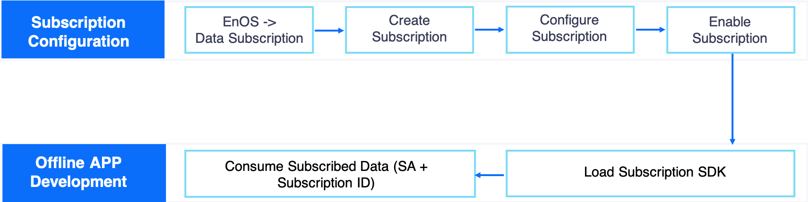

# Managing Data Subscription
EnOS System provides data subscription service to improve the API calling efficiency of applications with active push of subscribed data, which supports subscription to real-time asset data, asset alert data, and asset meta data. Benefiting from the data subscription service, applications do not need to call APIs repeatedly and frequently to get asset data. Instead, applications can call APIs only when there are pushed data, thus improving API calling efficiency and reducing costs.

## Data Subscription Workflow

## Creating Subscription Topic
Log in EnOS Console and select the **Data Subscription** module. On the **Data Subscription** page, click the **New Subscription** button to open the topic configuration page. Select the data subscription type, configure the data filtering conditions, and save the configuration of the subscription topic.

## Configuring Subscription Topic

**Type**

EnOS enables developers to subscribe to different data sources. The subscription configuration for data sources is different. EnOS data subscription service supports the following data sources:

- **Real-time data**: Real-time telemetry of asset measure points uploaded to the cloud with timestamp.
- **Alert data**: Alert data are generated according to specific alert rules defined for real-time data.

**ID**

Each subscription topic has a unique ID. You can choose to define a subscription ID or use the system-generated one. Subscription ID can be composed of upper-case or lower-case letters, underscore, or dash.

**SA (Service Account)**

Each subscription topic must has an associated [Service Account](https://www.envisioniot.com/docs/app-development/en/latest/managing_apps.html#registering-an-application) (SA), which is used for consumer and data authentication.

**Customers**

Based on the data access permission of the selected SA (associated with purchased application), you can choose the customers whose data are to be subscribed to.

**Model Filter**

1. Filtering conditions for real-time data:
   - Filtering data by model and measure points (subscribing to data of specific measure points)
   - Filtering data by device tags (subscribing to data of specific devices)
2. Filtering conditions for alert data:
   - Filtering data by models (subscribing to alert data of specific model)
   - Filtering data by device tags (subscribing to data of specific devices)

## Enabling Subscription Topic

After the subscription topic is configured, find the saved topic on the **Data Subscription** page, and click the **Enable** icon to run the subscription topic. The data producer will start writing data to the topic.

## Deleting Subscription Topic

You can choose to delete a subscription topic on the **Data Subscription** page. Note that topics in running status cannot be deleted and that deleted topics cannot be restored.
